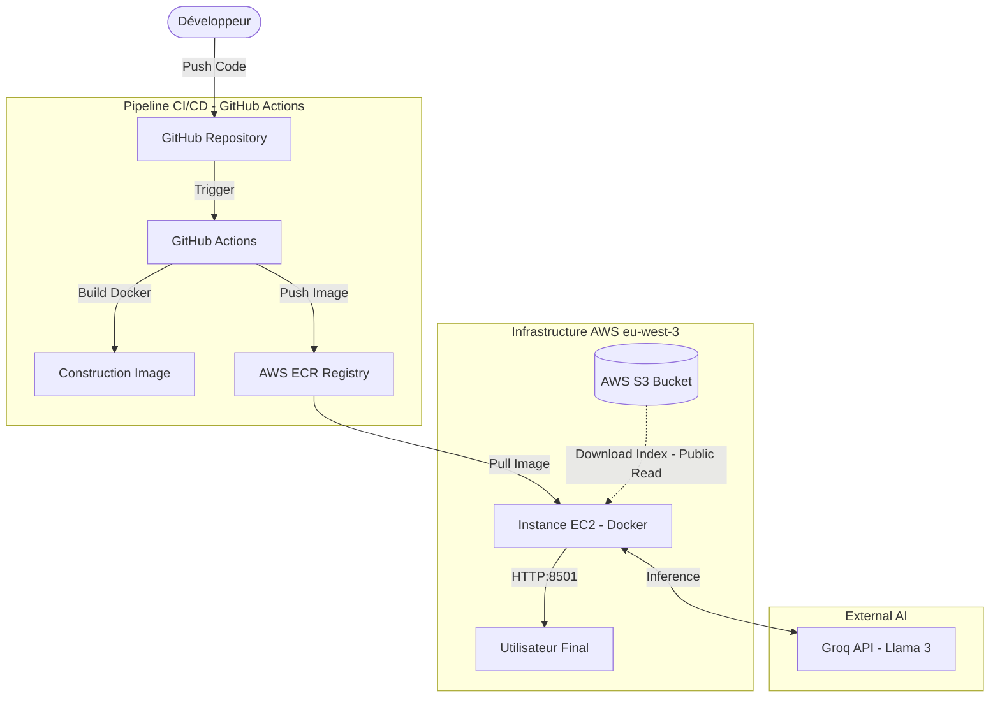

# MLOps RAG Chatbot: Cloud Native Architecture

Ce projet implémente un Chatbot **RAG (Retrieval-Augmented Generation)** complet, déployé sur une infrastructure Cloud AWS.
L'objectif est de fournir des réponses précises basées sur un corpus documentaire spécifique (cours de NLP), en utilisant une architecture MLOps robuste pour l'automatisation du déploiement (CI/CD) via Docker et EC2.

---

## 📑 Sommaire

- [🔗 Liens Rapides](#-liens-rapides)
- [🏗️ Architecture Technique & Flux de Données](#-architecture-technique--flux-de-données)
- [📋 Informations Infrastructure AWS](#-informations-infrastructure-aws)
- [🔐 Gestion de la Sécurité & Contraintes Étudiantes](#-gestion-de-la-sécurité--contraintes-étudiantes)
- [✅ Feuille de Route et Avancement](#-feuille-de-route-et-avancement)
- [📦 Structure du Projet](#-structure-du-projet)
- [🚀 Guide de Déploiement (Mémo EC2)](#-guide-de-déploiement-mémo-ec2)
- [🔧 Stack Technique](#-stack-technique)
- [📊 Métriques et Monitoring](#-métriques-et-monitoring)
- [🔄 Workflow CI/CD](#-workflow-cicd)
- [👥 Équipe](#-équipe)

---

## 🔗 Liens Rapides

| Environnement | Statut | Lien |
| :--- | :---: | :--- |
| **Production (AWS EC2)** | 🟢 Stable | [Accéder au Chatbot (IP Publique)](http://15.188.63.159:8501/) |
| **Test (Streamlit Cloud)** | 🟡 Dev | [Accéder à l'env de Test](https://mlops-rag-chatbot.streamlit.app/) |
| **Code Source** | 📦 Git | [Repository GitHub](https://github.com/Amik24/mlops-rag-chatbot) |

---

## 🏗️ Architecture Technique & Flux de Données

Le schéma ci-dessous illustre le pipeline CI/CD automatisé et l'interaction entre les services AWS en production sur EC2.



### Fonctionnement du Pipeline

1. **CI/CD :** À chaque `git push` sur la branche `main`, un workflow GitHub Actions construit l'image Docker et la pousse sur le registre privé **AWS ECR**.
2. **Infrastructure (IaaS) :** Une instance **AWS EC2** (t3.medium) sert d'hôte. Elle utilise un Rôle IAM spécifique pour s'authentifier automatiquement auprès d'ECR sans gestion de clés manuelles.
3. **Démarrage (Runtime) :** Le conteneur Docker télécharge l'index Vectoriel (FAISS) depuis **S3** via un accès lecture seule optimisé (Boto3 Unsigned).
4. **Inférence :** L'application Streamlit interroge l'API **Groq (Llama 3)** pour générer les réponses.

---

## 📋 Informations Infrastructure AWS

Configuration des ressources déployées dans la région `eu-west-3` (Paris).

| Clé | Valeur Documentée |
| --- | --- |
| **Région AWS** | `eu-west-3` |
| **ID de Compte AWS** | `073184925698` |
| **Instance Type** | `t3.medium (30GB EBS)` |
| **Nom du Bucket S3** | `g1-data` |
| **Nom du Repository ECR** | `g1-mlops` |
| **URI ECR Complet** | `073184925698.dkr.ecr.eu-west-3.amazonaws.com/g1-mlops:latest` |
| **Nom de l'Instance EC2** | `G1MG03-rag-bot` |
| **Rôle IAM EC2** | `g1mg03-EC2-Docker-Role` |

---

## 🔐 Gestion de la Sécurité & Contraintes Étudiantes

### Problématique

L'environnement *AWS Learner Lab* impose des sessions de courte durée (4 heures). Les credentials classiques expirent, ce qui stopperait l'application en production. De plus, les services managés comme App Runner présentaient des problèmes de compatibilité WebSocket avec Streamlit.

### Solutions Architecturales Implémentées

1. **S3 Public (Lecture Seule) :** Le bucket `g1-data` est configuré en lecture publique pour les fichiers d'index. Le code Python utilise `botocore.UNSIGNED`, rendant l'application autonome vis-à-vis des clés AWS expirables.

2. **Rôle IAM EC2 :** L'instance EC2 utilise un "Instance Profile" (`AmazonEC2ContainerRegistryReadOnly`) pour puller les images Docker sans jamais stocker de clés d'accès en dur.

3. **Conteneurisation Docker :** L'usage de Docker sur EC2 permet de contourner les limitations de mémoire et de WebSocket rencontrées sur les solutions PaaS.

---

## ✅ Feuille de Route et Avancement

### I. INFRASTRUCTURE AWS

| Tâche | Statut | Notes |
| --- | --- | --- |
| **1.1 Bucket S3 & Data** | ✅ Fait | Stockage PDF et Index Vectoriel. |
| **1.2 Repository ECR** | ✅ Fait | Stockage des images Docker de production. |
| **1.3 Instance EC2** | ✅ Fait | Migration réussie depuis App Runner vers EC2 (t3.medium). |
| **1.4 Rôle IAM** | ✅ Fait | Authentification automatique EC2 -> ECR. |

### II. CI/CD & DOCKER

| Tâche | Statut | Notes |
| --- | --- | --- |
| **2.1 GitHub Actions** | ✅ Fait | Build & Push automatique vers ECR. |
| **2.2 Dockerfile** | ✅ Fait | Optimisé pour Streamlit (Port 8501, Chemins corrigés). |
| **2.3 Gestion Secrets** | ✅ Fait | Injection sécurisée de `GROQ_API_KEY` au runtime. |

### III. DATA & APP

| Tâche | Statut | Notes |
| --- | --- | --- |
| **3.1 ETL Pipeline** | ✅ Fait | Scripts de chunking et embedding (FAISS). |
| **3.2 Interface RAG** | ✅ Fait | Chatbot fonctionnel. |
| **3.3 Déploiement** | ✅ Fait | Application accessible via IP Publique. |

---

## 📦 Structure du Projet

```
mlops-rag-chatbot/
├── .github/
│   └── workflows/              # Pipelines CI/CD
│       ├── test-aws.yml
│       ├── data-vectorization.yml
│       └── deploy-ecr.yml
├── src/
│   ├── data/                   # Scripts de préparation des données
│   │   ├── download_data.py
│   │   ├── build_embeddings.py
│   │   └── data_pipeline.py
│   └── app/                    # Code de l'application Chatbot
│       └── streamlit_app.py
├── Dockerfile                  # Configuration de l'image de production
├── requirements.txt            # Dépendances Python
└── README.md
```

---

## 🚀 Guide de Déploiement (Mémo EC2)

Commandes utilisées pour déployer sur l'instance EC2 :

```bash
# 1. Installation Docker sur Amazon Linux 2023
sudo yum update -y && sudo yum install -y docker
sudo service docker start && sudo usermod -a -G docker ec2-user

# 2. Login ECR (Automatique via IAM Role)
aws ecr get-login-password --region eu-west-3 | \
  sudo docker login --username AWS --password-stdin \
  073184925698.dkr.ecr.eu-west-3.amazonaws.com

# 3. Lancement du Conteneur
sudo docker run -d \
  -p 8501:8501 \
  -e GROQ_API_KEY='notre_cle_api' \
  --entrypoint streamlit \
  073184925698.dkr.ecr.eu-west-3.amazonaws.com/g1-mlops:latest \
  run /app/app/streamlit_app.py
```

### Commandes Utiles

```bash
# Vérifier les conteneurs en cours d'exécution
sudo docker ps

# Voir les logs du conteneur
sudo docker logs <container_id>

# Arrêter le conteneur
sudo docker stop <container_id>

# Mettre à jour l'application (pull nouvelle image)
sudo docker pull 073184925698.dkr.ecr.eu-west-3.amazonaws.com/g1-mlops:latest
```

---

## 🔧 Stack Technique

- **Cloud:** AWS (EC2, ECR, S3, IAM)
- **DevOps:** GitHub Actions, Docker
- **App:** Streamlit, Python 3.10
- **AI/ML:** LangChain, FAISS, Groq (Llama 3), HuggingFace Embeddings

---

## 📊 Métriques et Monitoring

- **Uptime:** Disponibilité 24/7 grâce à l'infrastructure EC2
- **Performance:** Instance t3.medium optimisée pour les workloads ML
- **Sécurité:** Authentification IAM Role, pas de clés en dur
- **Scalabilité:** Architecture conteneurisée prête pour orchestration (ECS/Kubernetes)

---

## 🔄 Workflow CI/CD

Le pipeline automatisé se déclenche à chaque push sur `main` :

1. **Build** : Construction de l'image Docker
2. **Test** : Validation des dépendances et de la structure
3. **Push** : Upload vers AWS ECR
4. **Deploy** : Pull automatique sur EC2 (manuel actuellement, automatisation possible)

---

## 👥 Équipe

**Groupe :** G1-MG03
