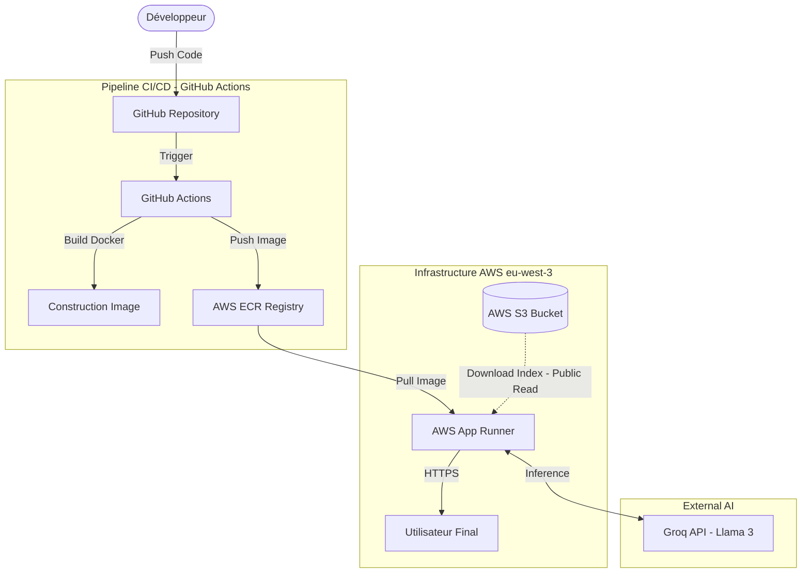

# MLOps RAG Chatbot: Cloud Native Architecture

Ce projet implémente un Chatbot **RAG (Retrieval-Augmented Generation)** , déployé sur une infrastructure Cloud AWS serverless.
L'objectif est de fournir des réponses précises basées sur un corpus documentaire spécifique de nos cours de NLP, en utilisant une architecture MLOps robuste pour l'automatisation du déploiement (CI/CD).

---

## 🔗 Liens Rapides

| Environnement | Statut | Lien |
| :--- | :---: | :--- |
| **Production (AWS)** | 🟢 Stable | [Accéder au Chatbot (App Runner)](https://fnvjr9jrnj.eu-west-3.awsapprunner.com/) |
| **Test (Streamlit)** | 🟡 Dev | [Accéder à l'env de Test](https://mlops-rag-chatbot.streamlit.app/) |
| **Code Source** | 📦 Git | [Repository GitHub](https://github.com/Amik24/mlops-rag-chatbot/tree/main) |

---

## Architecture Technique & Flux de Données

Le schéma ci-dessous illustre le pipeline CI/CD automatisé et l'interaction entre les services AWS en production.



### Fonctionnement du Pipeline

1. **CI/CD :** À chaque `git push` sur la branche `main`, un workflow GitHub Actions construit l'image Docker et la pousse sur **AWS ECR**.
2. **Déploiement Continu :** **AWS App Runner** est configuré en mode automatique. Il détecte la nouvelle image dans ECR et met à jour le service sans interruption.
3. **Démarrage (Runtime) :** Le conteneur télécharge l'index Vectoriel (FAISS) depuis **S3** via un accès lecture seule optimisé.
4. **Inférence :** L'application interroge l'API **Groq (Llama 3)** avec le contexte récupéré pour répondre à l'utilisateur.

---

## Informations Infrastructure AWS

Configuration des ressources déployées dans la région `eu-west-3` (Paris).

| Clé | Valeur Documentée |
| --- | --- |
| **Région AWS** | `eu-west-3` |
| **ID de Compte AWS** | `073184925698` |
| **Nom du Bucket S3** | `g1-data` |
| **Nom du Repository ECR** | `g1-mlops` |
| **URI ECR Complet** | `073184925698.dkr.ecr.eu-west-3.amazonaws.com/g1-mlops:latest` |
| **Nom du Service App Runner** | `g1mg03-rag-bot` |
| **Nom du Rôle IAM** | `AppRunnerECRAccessRoleG1MG03` |

---

## Gestion de la Sécurité & Contraintes Étudiantes

### Problématique

L'environnement *AWS Learner Lab* impose des sessions de courte durée (4 heures). Les credentials (`AWS_ACCESS_KEY_ID`, `AWS_SESSION_TOKEN`) expirent rapidement. Une application classique utilisant ces clés pour accéder à S3 cesserait de fonctionner après l'expiration de la session étudiante.

### Solution Architecturale Implémentée

Pour garantir la disponibilité **24/7** de l'application de production :

1. **Mode S3 Public (Lecture Seule) :** Le bucket `g1-data` a été configuré avec une `BucketPolicy` autorisant la lecture publique (`GetObject`) uniquement sur les fichiers d'index nécessaires au fonctionnement.
2. **Client Boto3 Anonyme :** Le code Python utilise `botocore.UNSIGNED` pour télécharger les fichiers sans authentification.
3. **Résultat :** L'App Runner n'a besoin d'aucune clé AWS pour tourner. Il ne nécessite que la clé API du modèle (`GROQ_API_KEY`), rendant le déploiement résilient et durable.

---

## Feuille de Route et Avancement (To-Do List)

État d'avancement du projet MLOps.

### I. INFRASTRUCTURE AWS

| Tâche Détaillée | Statut | Notes |
| --- | --- | --- |
| **1.1 Créer le Bucket S3 (g1-data)** | ✅ Fait | Stocke les PDFs et l'Index Vectoriel. |
| **1.2 Créer le Repository ECR (g1-mlops)** | ✅ Fait | **Critique.** Stocke l'image Docker de production. |
| **1.3 Téléverser documents PDF bruts** | ✅ Fait | Réalisé via console AWS. |
| **1.4 Téléverser l'Index Vectoriel final** | ✅ Fait | Artefact généré par le pipeline Data. |
| **1.5 Créer le Service App Runner** | ✅ Fait | Exécution serverless du site web. |
| **1.6 Configurer Politique S3 Publique** | ✅ Fait | Permet l'accès sans clés (Contournement Learner Lab). |

### II. STRUCTURE & CI/CD

| Tâche Détaillée | Statut | Notes |
| --- | --- | --- |
| **2.1 Structure Git (src/, .github/)** | ✅ Fait | Architecture modulaire. |
| **2.2 requirements.txt** | ✅ Fait | Dépendances Python fixées. |
| **2.3 Workflow test-aws.yml** | ✅ Fait | Valide les accès AWS. |
| **2.4 Workflow data-vectorization.yml** | ✅ Fait | Génère l'index et le pousse sur S3. |
| **2.5 Configurer Secrets GitHub** | ✅ Fait | Injection sécurisée des clés pour le CI. |
| **2.6 Créer le Dockerfile** | ✅ Fait | **Critique.** Définit l'environnement Linux + Python. |
| **2.7 Workflow deploy-ecr.yml** | ✅ Fait | Le pipeline CD : Build & Push Docker vers ECR. |

### III. DATA PIPELINE

| Tâche Détaillée | Statut | Notes |
| --- | --- | --- |
| **3.1 Script download_data.py** | ✅ Fait | Télécharge les PDF depuis S3. |
| **3.2 Script chunk_documents.py** | ✅ Fait | Découpe le texte pour le RAG. |
| **3.3 Script build_embeddings.py** | ✅ Fait | Crée `faiss_index.bin`. |
| **3.4 Script data_pipeline.py** | ✅ Fait | Orchestrateur des données. |
| **3.5 Générer Index (Local/CI)** | ✅ Fait | Validation de la création de l'index. |

### IV. APP RAG & DÉPLOIEMENT

| Tâche Détaillée | Statut | Notes |
| --- | --- | --- |
| **4.1 streamlit_app.py** | ✅ Fait | Code de l'interface. |
| **4.2 Chargement S3 dans l'App** | ✅ Fait | Téléchargement au démarrage (Mode Anonyme). |
| **4.3 Configuration Port App Runner** | ✅ Fait | Modification critique du port 8080 -> **8501**. |
| **4.4 Déploiement Final ECR** | ✅ Fait | Mise en production sur lien HTTPS public. |

---

## Structure du Projet

```
mlops-rag-chatbot/
├── .github/
│   └── workflows/
│       ├── test-aws.yml
│       ├── data-vectorization.yml
│       └── deploy-ecr.yml
├── src/
│   ├── data/
│   │   ├── download_data.py
│   │   ├── chunk_documents.py
│   │   ├── build_embeddings.py
│   │   └── data_pipeline.py
│   └── app/
│       └── streamlit_app.py
├── Dockerfile
├── requirements.txt
└── README.md
```

---

## Installation & Déploiement Local

### Prérequis

- Python 3.9+
- Docker (optionnel)
- Compte AWS avec accès S3 et ECR
- Clé API Groq

### Installation

```bash
# Cloner le repository
git clone https://github.com/Amik24/mlops-rag-chatbot.git
cd mlops-rag-chatbot

# Installer les dépendances
pip install -r requirements.txt

# Configurer les variables d'environnement
export GROQ_API_KEY="votre_clé_api"
```

### Lancer l'application localement

```bash
streamlit run src/app/streamlit_app.py
```

---

## 🔧 Technologies Utilisées

- **Cloud Provider:** AWS (S3, ECR, App Runner)
- **CI/CD:** GitHub Actions
- **Containerisation:** Docker
- **Framework Web:** Streamlit
- **Vector Database:** FAISS
- **Embeddings:** Sentence Transformers
- **LLM:** Groq API (Llama 3)
- **Language:** Python 3.9+

---

## Équipe

**Groupe :** G1-MG03  
**Cours :** MLOps & Cloud Computing


